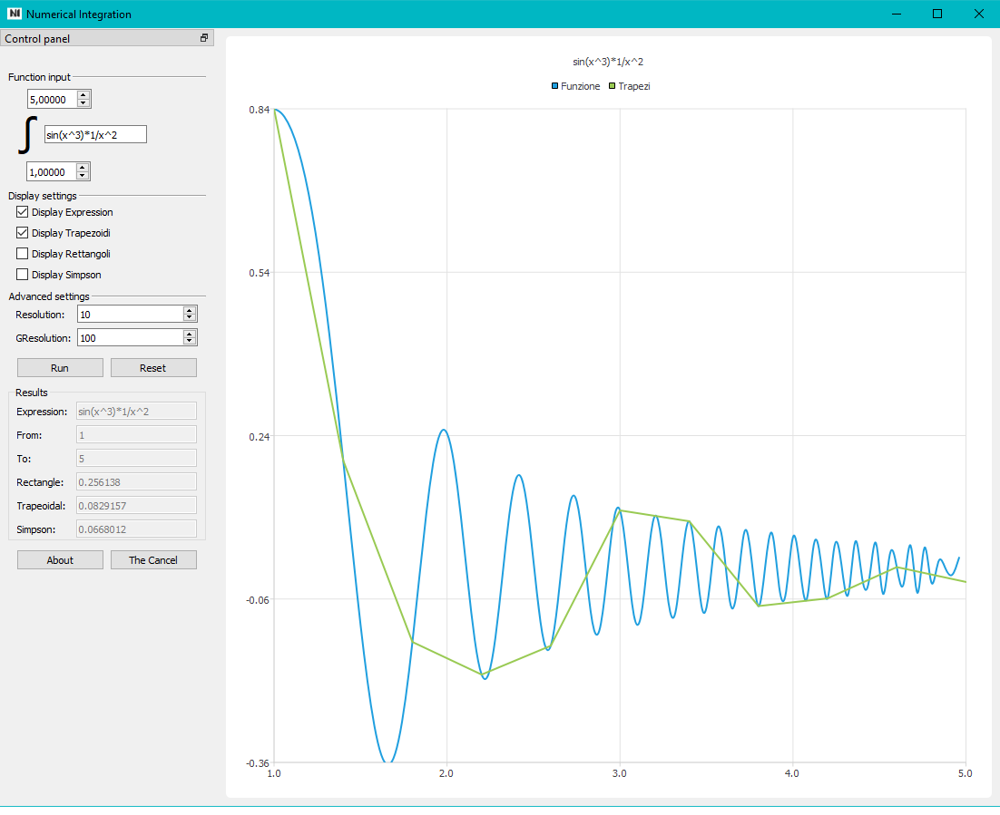

# NumericalIntegration
Numerical Integration is an High School Math class projects developed in February 2019 in collaboration with [Marco Fincato](https://github.com/marc0777).  
  
The Program's goal is to display the graph of an integral function as a function, trapezoid, rectangle and through Simpson' s rule.
It was developed with Qt Creator, uses Qt UI Framewiok and datatypes, uses [exprtk](https://github.com/ArashPartow/exprtk) for mathematical expression evaluation.
  
The program can be installed thorugh the Windows installer in the relese section of this repository.
  
## Screenshots

